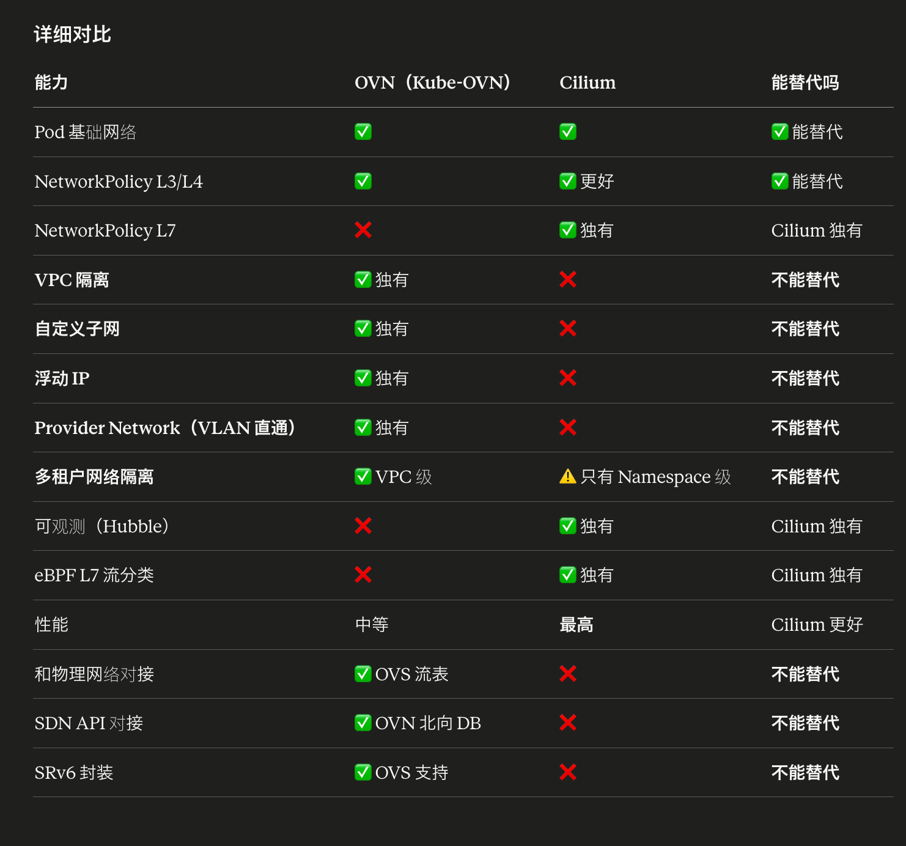
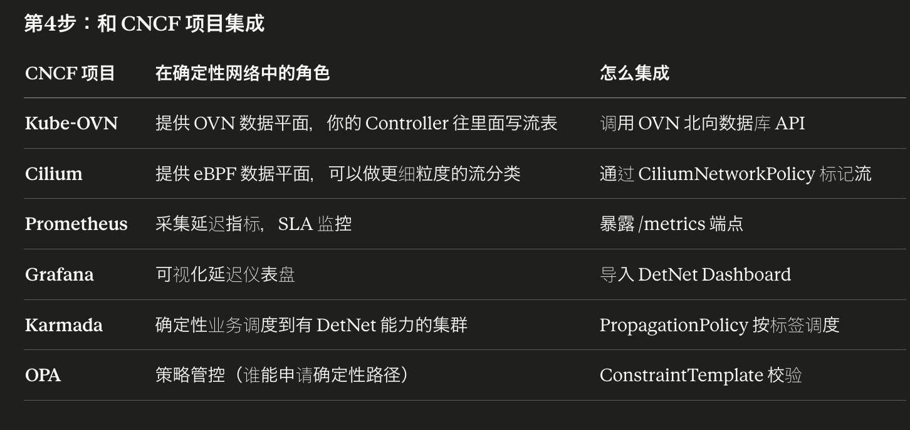

为什么需要 eBPF 补充
OVS 能做的流分类（L3/L4）：
✅ 源 IP = 172.16.1.10
✅ 目的 IP = 10.20.30.100
✅ TCP 端口 = 8080
✅ DSCP 值
❌ 不知道这是 GET /api/orders 还是 POST /api/scada/control
❌ 不知道 HTTP Header 里有什么
❌ 不知道 gRPC 调的哪个方法

问题场景：
同一个 SCADA 服务（IP 和端口都一样）
有两种请求：

POST /api/scada/control   → 实时控制指令（必须 < 5ms）
GET  /api/scada/history   → 历史数据查询（无所谓延迟）

OVS 分不出来！
因为 IP 和端口完全一样
只有 HTTP URL 不同

Cilium eBPF 能做的流分类（L7）：
✅ HTTP URL = /api/scada/control
✅ HTTP Method = POST
✅ HTTP Header = X-Priority: critical
✅ gRPC Method = ScadaService.SendControl
→ 看得到应用层内容，分类更精细
架构：OVS + eBPF 双数据面
数据包
│
↓
┌───────────────────────────────────────────┐
│ Cilium eBPF（L7 流分类）                    │
│                                            │
│ 看 HTTP/gRPC 内容                          │
│ POST /api/scada/control → 打 DSCP=46      │
│ GET  /api/scada/history → 打 DSCP=0       │
│                                            │
│ eBPF 在内核里执行，性能极高                  │
│ 分类完毕后交给 OVS                          │
└──────────────┬────────────────────────────┘
↓ 已经打好 DSCP 标记的包
┌──────────────┴────────────────────────────┐
│ OVS（L3/L4 路径执行）                       │
│                                            │
│ 看 DSCP 标记                               │
│ DSCP=46 → SRv6 确定性路径                  │
│ DSCP=0  → 普通路由                         │
│                                            │
│ OVS 不需要看 HTTP 内容                      │
│ eBPF 已经帮它分好类了                       │
└──────────────┬────────────────────────────┘
↓
物理网络（SDN 管的）
类比：

eBPF = 安检员（打开箱子看里面是什么）
看到急救药品 → 贴红色紧急标签（DSCP=46）
看到普通包裹 → 贴绿色普通标签（DSCP=0）

OVS = 传送带调度员（看标签分拣）
红色标签 → 紧急通道
绿色标签 → 普通通道

安检员看内容，调度员看标签
各司其职，配合高效
具体场景
SCADA 服务（一个 Pod，一个 IP，一个端口 8080）

请求1：POST /api/scada/control
内容：{"action": "close_breaker", "station": "beijing-001"}
→ 关闭断路器，必须 5ms 内到达，否则设备损坏
→ 需要确定性网络 DSCP=46

请求2：GET /api/scada/history?date=2026-04-13
内容：查询历史记录
→ 慢点没关系，100ms 也行
→ 普通网络 DSCP=0

请求3：POST /api/scada/control
HTTP Header: X-Priority: emergency
内容：{"action": "emergency_shutdown", "station": "all"}
→ 紧急停机！比普通控制更紧急
→ 最高优先级 DSCP=48

三个请求目的 IP 和端口完全相同
只有 eBPF 能在 L7 层区分

完整数据包旅程
Java 代码发 HTTP 请求：

POST /api/scada/control HTTP/1.1
Host: scada-server:8080
X-Priority: emergency
Content-Type: application/json

{"action": "emergency_shutdown", "station": "all"}

────────── 数据包旅程 ──────────

第1步：Java 代码发出 HTTP 请求
[IP: 172.16.1.10 → 172.16.1.20] [TCP: xxx → 8080]
[HTTP: POST /api/scada/control, X-Priority: emergency]
DSCP = 0（默认）
│
↓
第2步：Cilium eBPF 拦截（L7 流分类）
eBPF 程序在内核态执行，看 HTTP 内容：
✅ Method = POST
✅ Path = /api/scada/control
✅ Header X-Priority = emergency
→ 匹配规则：DSCP = 48（紧急）
→ 修改数据包 IP 头的 TOS 字段
DSCP: 0 → 48
│
↓
第3步：OVS 匹配（L3/L4 路径选择）
OVS 流表匹配 DSCP=48：
→ 优先级 400（最高）
→ 走紧急 SRv6 路径
→ 从物理网卡出去
│
↓
第4步：物理网络（SDN 管的）
TOR-4 看到 DSCP=48 + SRv6 头部：
→ 最高优先级队列
→ 按段列表转发
→ 不排队，直接发
│
↓
第5步：到达 SCADA 服务器
总延迟 < 2ms ✅（紧急路径更短）

────── 另一个请求 ──────

GET /api/scada/history?date=2026-04-13 HTTP/1.1
Host: scada-server:8080

第1步：同一个 Pod 发出
DSCP = 0（默认）
│
↓
第2步：Cilium eBPF
Method = GET, Path = /api/scada/history
→ 匹配规则：DSCP = 0（普通）
→ 不修改 DSCP
│
↓
第3步：OVS
DSCP=0 → 不匹配任何确定性规则
→ 走 Kube-OVN 默认路由
→ 普通 Geneve 隧道
│
↓
第4步：物理网络
普通优先级队列
可能排队
│
↓
第5步：到达
延迟 5ms~50ms（不保证，但够用）

同一个 Pod、同一个端口的两个请求
走了完全不同的网络路径！
eBPF 做到了 OVS 做不到的 L7 级别区分
OVS 和 eBPF 的分工
┌──────────────────────────────────────────────────┐
│ 同一个数据包经过两次处理                           │
│                                                   │
│ 第1次：Cilium eBPF（分类 + 打标记）                │
│   位置：Pod 网卡出口（tc egress hook）             │
│   能力：看 L7 内容（HTTP URL/Header/gRPC Method）  │
│   动作：修改 DSCP 字段                             │
│   性能：内核态执行，纳秒级，零拷贝                  │
│   输出：打好标记的数据包                           │
│                                                   │
│ 第2次：OVS（路径选择 + 转发）                      │
│   位置：br-int 虚拟交换机                          │
│   能力：看 L3/L4（IP/端口/DSCP）                   │
│   动作：根据 DSCP 选择 SRv6 路径                   │
│   输出：封装好的数据包，从物理网卡发出              │
│                                                   │
│ eBPF 负责"看内容贴标签"                           │
│ OVS 负责"看标签选路径"                             │
│ 各自做最擅长的事                                   │
└──────────────────────────────────────────────────┘

面试话术
"在 DetNet 架构中，我们采用 Cilium eBPF + OVS 双数据面实现精细化流分类。OVS 只能做到 L3/L4 级别的匹配（IP + 端口 + DSCP），但同一个 SCADA 服务的实时控制指令和历史查询用的是同一个 IP 和端口，OVS 区分不了。所以我们在 Pod 出口处挂载 Cilium eBPF 程序，在内核态解析 HTTP Method、URL Path 和 Header，根据 L7 内容给数据包打不同的 DSCP 标记——POST /api/scada/control 打 DSCP=46 走确定性路径，GET /api/scada/history 保持 DSCP=0 走普通路由。eBPF 负责'看内容贴标签'，OVS 负责'看标签选路径'，SDN Controller 负责'按路径配设备'。三层配合实现了同一个服务内不同 API 走不同网络路径的精细化流量治理，而业务代码只需要在紧急场景加一个 HTTP Header。"

核心差距：VPC
OVN 能做的（Cilium 做不了）：

kubectl apply Vpc tenant-a-vpc
kubectl apply Subnet 172.16.1.0/24
kubectl apply Subnet 172.16.2.0/24

→ 两个租户完全独立的虚拟网络
→ 各自有独立的 IP 地址空间（可以重叠）
→ 各自有独立的路由表
→ 各自有独立的网关
→ VNI 隔离，L2 层完全不通

Cilium 能做的：
NetworkPolicy 控制"谁能访问谁"
但底层还是同一个网络
→ tenant-a 的 Pod IP 和 tenant-b 不能重叠
→ 没有独立路由表
→ 没有 VNI 隔离
→ 本质是"防火墙规则"，不是"独立网络"

类比：
OVN VPC = 两栋独立的楼（各自的电梯、大门、门牌号）
Cilium NetworkPolicy = 同一栋楼里锁了门（同一部电梯，但某些楼层不让去）
核心差距：和 SDN/物理网络对接
OVN 能做的（Cilium 做不了）：

DetNet Controller → OVN 北向 API → OVS 流表
→ SRv6 封装
→ DSCP 标记
→ VLAN tag
→ Geneve 隧道
→ 和物理交换机对接

OVN/OVS 是 SDN 世界的标准数据面
你在紫金山开发的 SDN 控制器就是操作 OVS 的
→ OVN 是 K8s 和 SDN 之间的"桥梁"

Cilium 的 eBPF：
运行在 Linux 内核里
不经过 OVS
不产生标准的 OpenFlow 流表
→ SDN Controller 控制不了 eBPF
→ 无法和物理交换机对接
→ 无法做 SRv6 封装
正确的方案：互补，不是替代
┌─────────────────────────────────────────────┐
│ Cilium eBPF                                  │
│                                              │
│ 擅长：                                       │
│   L7 流分类（HTTP/gRPC 内容感知）             │
│   高性能转发（绕过 iptables）                 │
│   可观测（Hubble 服务拓扑图）                 │
│   细粒度安全策略（L7 NetworkPolicy）          │
│                                              │
│ 角色：流分类 + 打标记                         │
├─────────────────────────────────────────────┤
│ OVN/OVS（Kube-OVN）                          │
│                                              │
│ 擅长：                                       │
│   VPC/子网/浮动 IP（传统网络模型）             │
│   OVS 流表（SDN 对接）                       │
│   SRv6 封装（确定性路径）                     │
│   Provider Network（VLAN 直通）              │
│   和物理交换机对接                            │
│                                              │
│ 角色：VPC 隔离 + 路径执行 + SDN 桥梁          │
└─────────────────────────────────────────────┘
在你的项目里怎么组合
场景1：纯 aPaaS 平台（多租户 SaaS）
→ 用 Cilium 就够了
→ 不需要 VPC（应用层 Header 隔离）
→ 需要 L7 策略和高性能
→ 需要 Hubble 可观测

场景2：纯 IaaS 平台（模拟阿里云）
→ 必须用 OVN（Kube-OVN）
→ 需要 VPC/子网/浮动 IP
→ 需要和物理网络对接
→ Cilium 做不了

场景3：网云融合（你的项目，最复杂）
→ 两个都用
→ Cilium：L7 流分类 + 打 DSCP 标记
→ OVN：VPC 隔离 + SRv6 路径 + SDN 对接
→ 数据包先过 Cilium eBPF，再过 OVS
你的项目架构：

数据包 → Cilium eBPF（L7 分类，打 DSCP）
↓
OVS/OVN（VPC 隔离 + SRv6 封装）
↓
物理网络（SDN Controller 管的）

三层各司其职，缺一不可

没有 readinessProbe：
Pod 容器启动了 → K8s 立刻给它分配流量
但 Spring Boot 还在初始化（连数据库、加载缓存）
→ 用户请求进来 → 报错 500
→ 持续 30 秒直到应用真正启动完成

有了 readinessProbe：
Pod 容器启动了 → K8s 开始探测 /actuator/health
→ 返回 503 → 不给流量（还没准备好）
→ 返回 503 → 不给流量
→ 返回 200 → 开始给流量（准备好了）
→ 用户请求进来 → 正常响应

三大 CNI 深入对比
一句话区别
Calico  = 传统路由方式（BGP），简单够用
Kube-OVN = 虚拟交换机方式（OVS/OVN），功能最全
Cilium  = 内核黑科技方式（eBPF），性能最强
类比
Calico  = 普通公路（红绿灯+路牌指路，简单但够用）
Kube-OVN = 城市地铁系统（站点/线路/换乘，功能多但重）
Cilium  = 高铁（直达，速度快，技术新）
技术栈对比
Calico              Kube-OVN            Cilium
┌──────┐           ┌──────┐           ┌──────┐
控制面    │ BGP   │           │ OVN  │           │ eBPF │
│ Felix │           │ 北向DB│           │ Agent│
└──┬───┘           │ 南向DB│           └──┬───┘
│               └──┬───┘              │
数据面    ┌──┴───┐           ┌──┴───┐           ┌──┴───┐
│iptables│         │ OVS  │           │eBPF  │
│/IPVS  │         │虚拟交换│           │内核钩子│
└──────┘           └──────┘           └──────┘
详细对比
维度CalicoKube-OVNCilium数据面技术iptables/IPVSOVS（Open vSwitch）eBPF控制面技术BGP + FelixOVN 北向/南向数据库eBPF Agent内存占用~200MB~1.5GB~500MB性能好中等最好（绕过 iptables）VPC 隔离❌✅❌（需要额外配置）子网管理❌✅❌浮动 IP❌✅❌NetworkPolicy✅✅✅（更强大）可观测性基础中等最强（Hubble）学习曲线低高中适合场景90%通用场景IaaS/传统网络模型高性能/安全敏感和 OpenStack 对应无替代 Neutron无

OVN 的北向和南向数据库
┌──────────────────────────────────────┐
│  用户 / Kube-OVN Controller          │
│  "我要创建一个 VPC，子网 172.16.1.0/24"│
└──────────────┬───────────────────────┘
↓ 写入
┌──────────────┴───────────────────────┐
│         OVN 北向数据库（NB DB）         │
│                                       │
│  存的是"意图"：                         │
│  ├── 逻辑交换机: tenant-a-switch       │
│  ├── 逻辑路由器: tenant-a-router       │
│  ├── 逻辑端口: port-1 (IP: 172.16.1.2)│
│  └── ACL 规则: 允许 TCP 80             │
│                                       │
│  → 类似"设计图"                        │
│  → 描述网络应该长什么样                  │
│  → 不关心具体怎么实现                   │
└──────────────┬───────────────────────┘
↓ ovn-northd 翻译
┌──────────────┴───────────────────────┐
│         OVN 南向数据库（SB DB）         │
│                                       │
│  存的是"指令"：                         │
│  ├── 绑定关系: port-1 在 iaas-1 节点   │
│  ├── 流表: match(ip.dst==172.16.1.2)  │
│  │         → action(output:port-1)    │
│  ├── MAC 表: 00:11:22:33:44:55 → port │
│  └── 隧道: iaas-1 ↔ iaas-2 (Geneve)  │
│                                       │
│  → 类似"施工图"                        │
│  → 描述每个节点具体怎么转发数据包        │
│  → 精确到流表规则                       │
└──────────────┬───────────────────────┘
↓ ovn-controller 执行
┌──────────────┴───────────────────────┐
│         OVS（每个节点上）               │
│                                       │
│  执行南向数据库的流表指令               │
│  实际转发数据包                        │
│                                       │
│  iaas-1 的 OVS：                      │
│    流表1: 目的IP=172.16.1.2 → 端口3   │
│    流表2: 目的IP=172.16.2.x → 丢弃    │
│           （不同 VPC 不通）             │
└──────────────────────────────────────┘

KubeVirt 虚拟机场景下的隧道和 SRv6
先理解：VM 在 K8s 里的网络本质
你创建的 vm-01 本质上是一个 Pod，里面跑 QEMU

kubectl -n tenant-a get pod -l kubevirt.io/vm=vm-01

Pod 结构：
┌─────────────────────────────────┐
│ Pod（virt-launcher-vm-01-xxx）   │
│                                  │
│  ┌───────────────────────────┐  │
│  │ 容器：virt-launcher        │  │
│  │                            │  │
│  │  ┌─────────────────────┐  │  │
│  │  │ QEMU 进程            │  │  │
│  │  │                      │  │  │
│  │  │  ┌────────────────┐ │  │  │
│  │  │  │ VM（CirrOS）    │ │  │  │
│  │  │  │ 虚拟网卡 eth0   │ │  │  │
│  │  │  │ IP: 172.16.1.x │ │  │  │
│  │  │  └────────────────┘ │  │  │
│  │  └─────────────────────┘  │  │
│  └───────────────────────────┘  │
│                                  │
│  Pod IP: 10.244.x.x（Kube-OVN分配）│
│  VM IP: 172.16.1.x（VPC 子网）    │
└─────────────────────────────────┘
VM 的网络有两层
第1层：Pod 网络（Kube-OVN 管）
Pod IP: 10.244.1.50
→ 这是 K8s 看到的 IP
→ Kube-OVN 通过 Geneve 隧道实现跨节点通信

第2层：VM 内部网络（QEMU 虚拟网卡）
VM IP: 172.16.1.10（tenant-a-vpc 的子网）
→ 这是 VM 里面看到的 IP
→ 通过 TAP 设备桥接到 Pod 网络

数据包经过两次封装：
VM 发出 → TAP 设备 → Pod 网络 → OVS → Geneve 隧道 → 对端 OVS → 对端 Pod → 对端 VM
完整数据包路径
场景：tenant-a 的 VM-01(iaas-1) 和 VM-02(iaas-3) 通信

VM-01(iaas-1)                                      VM-02(iaas-3)
IP: 172.16.1.10                                    IP: 172.16.1.20

VM-01 发出数据包：
[源: 172.16.1.10] → [目的: 172.16.1.20] [数据]
↓
TAP 设备（虚拟网线，连接 VM 和 Pod 网络）
↓
OVS br-int（iaas-1 上的虚拟交换机）
↓
Kube-OVN 流表匹配：
目的 172.16.1.20 在 tenant-a-vpc 子网
→ 查到对应 Pod 在 iaas-3 上
→ Geneve 封装
↓
封装后的数据包：
┌────────────────────────────────────────────┐
│ 外层 IP: 10.10.10.121 → 10.10.10.123     │ ← 节点真实 IP
│ 外层 UDP: 端口 6081（Geneve）              │
│ Geneve 头: VNI=100（tenant-a-vpc 的标识）  │ ← VPC 隔离靠这个
│ ┌────────────────────────────────────────┐│
│ │ 内层: 172.16.1.10 → 172.16.1.20       ││ ← VM 的真实数据
│ │ [数据]                                  ││
│ └────────────────────────────────────────┘│
└────────────────────────────────────────────┘
↓
物理网络 → 到达 iaas-3
↓
OVS br-int（iaas-3）拆掉 Geneve 外层
↓
TAP 设备 → VM-02 收到数据包

类比
你的 SDN = 交通局
管的是：修路、建桥、设红绿灯、规划高速路线
设备：路由器(立交桥)、交换机(十字路口)、防火墙(收费站)
协议：BGP/OSPF(城市之间怎么连)、SRv6(走哪条高速)
范围：整个城市/国家的交通网络

K8s CNI = 园区物业
管的是：园区内部道路、楼与楼之间怎么走
设备：OVS(虚拟交换机)、Geneve隧道(楼间通道)
范围：一个园区内部

Service Mesh = 快递调度系统
管的是：包裹走哪条路线、失败重试、限速
不修路，只是在现有路上做调度
范围：应用之间的请求级别
网络分层对比
┌─────────────────────────────────────────────────────────┐
│ L7 应用层    │ Service Mesh（Istio/Dapr）                │
│              │ HTTP 路由、重试、限流、熔断                │
│              │ → 管"请求怎么发"                          │
├──────────────┼──────────────────────────────────────────┤
│ L4 传输层    │ kube-proxy / Service                     │
│              │ TCP 负载均衡、端口转发                     │
│              │ → 管"连接发给哪个 Pod"                    │
├──────────────┼──────────────────────────────────────────┤
│ L3 网络层    │ K8s CNI（Calico/Kube-OVN/Cilium）        │
│（虚拟）      │ Pod IP、VPC、Overlay 隧道                 │
│              │ → 管"Pod 之间怎么通信"                    │
├══════════════╪══════════════════════════════════════════╡
│              │ ↑↑↑ 以上是 K8s 管的（虚拟世界）↑↑↑        │
│              │ ↓↓↓ 以下是你的 SDN 管的（物理世界）↓↓↓    │
├══════════════╪══════════════════════════════════════════╡
│ L3 网络层    │ 你的 SDN 控制器                           │
│（物理）      │ BGP/OSPF 路由、SRv6 路径、DetNet QoS     │
│              │ → 管"真实路由器之间怎么转发"               │
├──────────────┼──────────────────────────────────────────┤
│ L2 链路层    │ 你的 SDN 控制器                           │
│              │ VLAN、MAC 表、交换机端口                   │
│              │ → 管"真实交换机怎么交换"                   │
├──────────────┼──────────────────────────────────────────┤
│ L1 物理层    │ 光纤、网线、物理交换机                     │
│              │ → 不需要管                                │
└──────────────┴──────────────────────────────────────────┘

中间那条粗线 = Underlay 和 Overlay 的分界线
你的 SDN = Underlay（物理网络）
K8s CNI = Overlay（虚拟网络，跑在你的 SDN 之上）

大规模场景下的出口节点
小集群（你的 3 节点）：
每个节点都能当出口，不需要专门设置

大规模生产环境（100+ 节点）：
会专门指定 2-3 个节点当"出口节点"

┌─── K8s 集群 ──────────────────────────────┐
│                                            │
│  worker-1 ~ worker-97（业务节点，跑 Pod）    │
│                                            │
│  gateway-1  gateway-2（出口节点）            │
│  ↓          ↓                              │
└──┼──────────┼──────────────────────────────┘
│          │
↓          ↓
物理路由器（双上联，高可用）

为什么要专门设出口节点：
① 方便管理：防火墙规则只配在 2 台上，不用配 100 台
② 安全审计：所有出站流量经过固定节点，方便抓包分析
③ 性能：出口节点可以配更好的网卡（25G/100G）

K8s 内部网络延迟本质上还是物理网络延迟
所谓的"K8s 内部网络"：

VM(node-01) → OVS → Geneve 封装 → 物理网卡 → ??? → 物理网卡 → OVS → VM(node-50)
↑
│
这段是什么？
│
↓
物理交换机（TOR → Spine → TOR）
你的 SDN 管的！
Geneve 隧道只是在两端做封装/拆封装
中间的传输完全走物理网络
物理网络的延迟就是 K8s "内部"延迟

所以：
"优化 K8s 内部延迟" = "优化数据中心内部的 SDN 路径"
→ 还是你的 SDN 的活！
分层关系
┌─────────────────────────────────────────────┐
│ Kube-OVN（K8s CNI）                          │
│                                              │
│ 做的事：                                      │
│   ① 给 Pod 分配 IP                           │
│   ② Geneve 封装/拆封装（两端打包拆包）          │
│   ③ VNI 隔离（区分 VPC）                      │
│                                              │
│ 不做的事：                                    │
│   ❌ 不管中间物理网络怎么转发                   │
│   ❌ 不管走哪个交换机                          │
│   ❌ 不管延迟多少                              │
│                                              │
│ Kube-OVN 只是两端的"打包员"                   │
│ 包裹打好后交给物理网络运输                     │
│ 运输过程完全由 SDN 控制                       │
└──────────────┬──────────────────────────────┘
│ Geneve 封装后的包
│ 外层 IP: 10.10.10.121 → 10.10.10.150
↓
┌─────────────────────────────────────────────┐
│ 物理网络（你的 SDN 管的）                      │
│                                              │
│   TOR-1 → Spine-1 → TOR-5                   │
│   或者                                       │
│   TOR-1 → Spine-2 → Spine-3 → TOR-5（绕路）  │
│                                              │
│ 延迟取决于：                                  │
│   走了几跳交换机                              │
│   交换机有没有拥堵                             │
│   SDN 选了什么路径                            │
│                                              │
│ → 这段延迟 100% 由 SDN 决定                   │
│ → Kube-OVN 完全管不了                         │
└─────────────────────────────────────────────┘
所以 DetNet Controller 在 K8s 内部做的"优化"是什么？
不是优化 Kube-OVN！
而是通过 Kube-OVN 的 OVN 数据库，
间接操作底层 OVS，
最终影响物理网络的路径选择！

层级关系：
DetNet Controller
→ 写 OVN 流表
→ OVS 按流表做 SRv6 封装
→ SRv6 头部告诉物理交换机走哪条路
→ 物理交换机按 SRv6 段列表转发

本质上：
DetNet Controller 是通过 K8s 的入口（OVN API）
去控制物理网络的路径

不是在优化"K8s 虚拟网络"
是在优化"K8s 节点之间的物理网络路径"
那 DetNet Controller 到底管了几段？
不是两段（K8s 内部 + 物理骨干网）
而是一段物理网络的两个区域：

┌─── 区域1：数据中心内部（Spine-Leaf）───┐
│                                        │
│  node-01 → TOR → Spine → TOR → node-50│
│  （出口节点）                            │
│                                        │
│  SDN 管的，延迟 0.1ms ~ 2ms            │
│  DetNet 通过 SRv6 控制走哪条路          │
│                                        │
└────────────────┬───────────────────────┘
│
│ 同一个 SRv6 段列表
│ 从数据中心内部延伸到骨干网
│
┌────────────────┴───────────────────────┐
│                                        │
│ 区域2：数据中心之间（骨干网）             │
│                                        │
│  路由器A(北京) → 路由器B(济南) → 路由器C  │
│                                        │
│  SDN 管的，延迟 1ms ~ 50ms             │
│  DetNet 通过 SRv6 控制走哪条路          │
│                                        │
└────────────────────────────────────────┘

两个区域本质上都是物理网络
都由 SDN 管控
DetNet Controller 用同一套 SRv6 段列表覆盖两个区域
正确的架构理解
之前的理解（不够准确）：
K8s 虚拟网络（Kube-OVN 管） + 物理骨干网（SDN 管）
DetNet 是两者的桥梁

正确的理解：
Kube-OVN 只管封装/拆封装 + VPC 隔离
所有的网络传输都是物理网络（SDN 管）
DetNet 是 SDN 的上层编排器
通过两个接口控制同一个物理网络：
OVN API → 控制数据中心内部的 OVS/交换机
Netconf → 控制数据中心之间的路由器
更准确的架构图：

┌──────────────────────────────────────────┐
│ DetNet Controller（统一编排）              │
│                                           │
│ 输入：业务需求（延迟<5ms, 带宽>100M）      │
│ 输出：端到端 SRv6 段列表                   │
│                                           │
│ 接口1: OVN API                            │
│   → 控制 OVS 流表                         │
│   → 影响数据中心内部转发                    │
│   → 但实际转发还是走 Spine-Leaf 物理交换机   │
│                                           │
│ 接口2: Netconf                            │
│   → 控制物理路由器                          │
│   → 影响数据中心之间转发                    │
├──────────────────────────────────────────┤
│ SDN 控制面（你在紫金山开发的）              │
│                                           │
│ 管理所有物理设备：                          │
│   数据中心内部: TOR/Spine 交换机            │
│   数据中心之间: 骨干网路由器                 │
│                                           │
│ DetNet Controller 通过 SDN 控制面          │
│ 间接控制物理设备                            │
├──────────────────────────────────────────┤
│ 物理网络设备                                │
│                                           │
│  TOR-1 ─ Spine-1 ─ TOR-5 ─ 路由器A ─ 路由器B│
│         数据中心内部          数据中心之间    │
│         都是物理设备                         │
│         都受 SDN 管控                        │
└──────────────────────────────────────────┘
那 Kube-OVN 的价值在哪？
既然物理网络延迟都是 SDN 管的，Kube-OVN 干嘛的？

Kube-OVN 解决的不是延迟问题，而是：
① 给 10 万个 Pod 分配 IP（物理网络没法管 10 万个虚拟 IP）
② VPC 隔离（物理 VLAN 只有 4096 个，VNI 有 1600 万个）
③ Pod 迁移后 IP 不变（物理网络做不到）
④ 声明式网络管理（kubectl apply 而不是登录交换机配命令）

类比：
Kube-OVN = 小区物业（管门牌号、信箱、门禁卡）
SDN = 交通局（管路怎么修、红绿灯怎么配）
DetNet = 急救车调度（在交通局的路上开辟绿色通道）

物业不修路，但管门牌号
交通局不管门牌号，但管路
急救车调度借交通局的路，按最快路线走
面试话术（修正版）
"K8s 内部节点间的通信本质上走的还是物理 Spine-Leaf 网络，Geneve 隧道只是在两端做封装拆封装，中间的传输延迟完全取决于物理网络路径。所以 DetNet Controller 在 K8s 集群内部做的'优化'，本质上是通过 OVN API 间接控制底层物理交换机的转发路径——把 SRv6 段列表从 OVS 延伸到 TOR、Spine 交换机，再延伸到骨干网路由器，形成端到端的统一路径控制。Kube-OVN 的价值不在于延迟优化，而在于 IP 管理、VPC 隔离和声明式网络管理。延迟优化是 DetNet + SDN 的事情，Kube-OVN 只是提供了一个 K8s 原生的入口来注入这些优化策略。"

正确的架构
数据中心内部的路径优化，必须用 Netconf 配物理交换机
OVN API 只做 OVS 层面的事情

┌──────────────────────────────────────────────────┐
│ DetNet Controller                                 │
│                                                   │
│ 接口1: OVN API（能力有限）                          │
│   能做的：                                         │
│     ✅ 在 OVS 上做 Geneve 封装/拆封装               │
│     ✅ 在 OVS 上做流分类（哪些流量需要确定性）        │
│     ✅ 在 OVS 上打 VNI 标记                        │
│     ✅ 在 OVS 上标记 DSCP/优先级                    │
│   不能做的：                                       │
│     ❌ 控制物理交换机的转发路径                      │
│     ❌ 获取 Spine-Leaf 拓扑                        │
│     ❌ 感知物理链路拥堵                             │
│                                                   │
│ 接口2: Netconf / OpenFlow（真正的路径控制）          │
│   能做的：                                         │
│     ✅ 获取 TOR/Spine 全域拓扑                      │
│     ✅ 配置物理交换机的 SRv6 策略                    │
│     ✅ 获取链路延迟/带宽/拥堵状态                    │
│     ✅ 控制数据包走哪些交换机                        │
│                                                   │
│ 接口3: Netconf（骨干网路由器）                       │
│     ✅ 控制数据中心之间的路径                        │
└──────────────────────────────────────────────────┘
OVN API 和 Netconf 各管什么
一个数据包从 VM 到目的地，经过三段：

段1：OVS 内部处理（OVN API 管）
VM → TAP → OVS br-int
→ 流分类：这个包需要确定性吗？
→ 需要 → 打上 SRv6 头部 + DSCP 优先级标记
→ 从物理网卡发出

段2：数据中心内部物理网络（Netconf 管）
物理网卡 → TOR-1 → Spine-1 → TOR-5 → 物理网卡
→ 物理交换机看到 SRv6 头部和 DSCP 标记
→ 按 SDN 控制器下发的策略转发
→ DetNet 通过 Netconf 配置了这些物理交换机

段3：骨干网（Netconf 管）
出口路由器 → 骨干路由器 → 目的路由器
→ 同样是 Netconf 配置
→ SRv6 段列表继续生效
明确分工：

OVN API 管的（OVS 层面，段1）：
"这个包要不要走确定性路径" → 流分类
"打上什么标记" → SRv6 头部 + DSCP
"发给哪个节点的 OVS" → Geneve 隧道目的

Netconf 管的（物理交换机，段2+段3）：
"包从 TOR-1 到 TOR-5 走哪条路" → 物理路径
"哪条链路拥堵了绕开" → 流量工程
"带宽怎么预留" → QoS 队列

两者配合：
OVS 打标记 → 物理交换机识别标记 → 按 SDN 策略转发
修正后的完整数据包旅程
VM(node-01) 发数据包给远端设备

第1步：OVS 处理（OVN API 配置的）

OVS 流表（DetNet Controller 通过 OVN API 写的）：
match: src=172.16.1.10, dst=10.20.30.100, tcp:8080
action:
① 打 DSCP 标记 = 46（最高优先级，EF 类）
② SRv6 封装（段列表由 Netconf 侧计算）
③ Geneve 封装，发给出口节点(node-50)

OVS 的角色：打标记 + 封装
不决定物理路径！

第2步：物理网卡发出

数据包：
┌──────────────────────────────────────┐
│ 外层 IP: 10.10.10.1 → 10.10.10.50   │
│ DSCP: 46（最高优先级）               │ ← OVS 打的标记
│ SRv6: [TOR-1, Spine-1, TOR-5,       │ ← Netconf 计算的路径
│        Router-A, Router-B]           │
│ Geneve: VNI=100                      │
│ 内层: 172.16.1.10 → 10.20.30.100    │
└──────────────────────────────────────┘

第3步：TOR-1 交换机（Netconf 配置的）

TOR-1 的配置（DetNet Controller 通过 Netconf 下发的）：
看到 SRv6 头部 → 下一段是 Spine-1
看到 DSCP=46 → 放入最高优先级队列
→ 即使其他流量拥堵，这个包优先转发
→ 发给 Spine-1

第4步：Spine-1 交换机（Netconf 配置的）

同样看 SRv6 头部 → 下一段是 TOR-5
DSCP=46 → 最高优先级队列
→ 发给 TOR-5

第5步：TOR-5 交换机 → node-50 物理网卡 → OVS

node-50 的 OVS（OVN API 配置的）：
拆 Geneve 封装
继续按 SRv6 段列表转发到骨干网

第6步：骨干网路由器（Netconf 配置的）

Router-A → Router-B → 目的设备
SRv6 段列表继续生效

修正后的架构图
┌───────────────────────────────────────────────────┐
│ DetNet Controller                                  │
│                                                    │
│ ┌─────────────┐ ┌──────────────┐ ┌──────────────┐ │
│ │拓扑采集      │ │CSPF 路径计算  │ │SLA 监控      │ │
│ │Netconf 获取  │ │在物理拓扑上算 │ │Netconf 采集  │ │
│ │TOR/Spine 拓扑│ │不是在 OVN 上算│ │交换机统计    │ │
│ └──────┬──────┘ └──────────────┘ └──────────────┘ │
│        │                                           │
│  ┌─────┴──────────────────────────────────┐       │
│  │ 三个下发接口                             │       │
│  │                                         │       │
│  │ ① OVN API → OVS                        │       │
│  │    只做：流分类 + 打标记 + 封装           │       │
│  │    不做：路径决策                         │       │
│  │                                         │       │
│  │ ② Netconf → TOR/Spine 物理交换机        │       │
│  │    做：SRv6 路径转发 + QoS 队列          │       │
│  │    这才是数据中心内部路径控制的关键！      │       │
│  │                                         │       │
│  │ ③ Netconf → 骨干网路由器                │       │
│  │    做：跨数据中心 SRv6 路径              │       │
│  └─────────────────────────────────────────┘       │
└───────────────────────────────────────────────────┘

OVN API 和 Netconf 的分工：

OVS（OVN API 控制）         物理交换机（Netconf 控制）
┌──────────┐                ┌──────────┐
│ 流分类    │                │ 路径转发  │
│ 打 DSCP  │  → 物理网卡 →  │ 按 SRv6  │
│ SRv6封装  │                │ 逐跳转发  │
│ Geneve   │                │ QoS 队列  │
└──────────┘                └──────────┘
入口包装                     中间运输
"贴标签"                     "按标签送货"

云管平台创建 VM 时的完整流程
用户在云管平台点击"创建虚拟机"
↓
平台自动完成以下所有配置
↓
┌──────────────────────────────────────────────────┐
│ 第1步：K8s 创建 VM（KubeVirt）                      │
│   kubectl apply VirtualMachine YAML               │
│   → Pod 调度到某个节点                              │
│   → QEMU 启动虚拟机                                │
├──────────────────────────────────────────────────┤
│ 第2步：OVN API 配置网络（Kube-OVN）                  │
│   ① 分配 IP（从 VPC 子网中分一个）                   │
│   ② 创建逻辑端口（OVN 北向数据库）                   │
│   ③ 流分类标记（如果是确定性业务）                    │
│      → 打 DSCP 标记                                │
│      → 加 SRv6 头部                                │
│   ④ VNI 绑定（属于哪个 VPC）                        │
│                                                    │
│   这一步在 VM 创建时自动完成                         │
│   不需要运维手动配置                                 │
├──────────────────────────────────────────────────┤
│ 第3步：与物理网络打通（二选一）                       │
│                                                    │
│   方式A：NAT（默认，自动的）                         │
│   方式B：Provider Network（需要提前配置）            │
└──────────────────────────────────────────────────┘

两种打通方式的配置时机
方式A：NAT

配置时机：不需要配置，K8s 默认就有

创建 VM 时：
→ Kube-OVN 分配 VPC 内部 IP（172.16.1.10）
→ iptables MASQUERADE 规则自动存在
→ VM 访问外部时自动 NAT
→ 不需要任何额外操作

流程：
云管创建 VM
↓ 自动
Kube-OVN 分配 IP + VNI
↓ 自动
iptables NAT 规则已存在
↓
VM 可以访问物理网络（通过 NAT）

方式B：Provider Network

配置时机：提前配好（一次性），创建 VM 时选择即可

提前配置（运维做一次）：
① 创建 ProviderNetwork（绑定物理网卡）
② 创建 Vlan（绑定物理 VLAN ID）
③ 创建 Subnet（绑定 VPC + VLAN）
→ 这三步只做一次

创建 VM 时：
→ 指定使用 physical-subnet
→ Kube-OVN 从物理子网分配 IP（10.20.30.50）
→ OVS 直接打 VLAN tag 从物理网卡出去
→ 不需要 NAT

流程：
运维提前配好 Provider Network（一次性）
↓
云管创建 VM，选 physical-subnet
↓ 自动
Kube-OVN 分配物理网络 IP
↓ 自动
OVS 配置 VLAN tag
↓
VM 直接接入物理 VLAN（不经过 NAT）
结合你的云管场景
你的 IaaS 云管平台（类似阿里云控制台）：

┌──────────────────────────────────────┐
│ 云管界面                              │
│                                       │
│ 创建虚拟机：                           │
│   名称：[power-dispatch-vm    ]       │
│   CPU：  [4核     ▼]                  │
│   内存： [8GB     ▼]                  │
│   镜像： [Ubuntu 22.04  ▼]           │
│                                       │
│   网络配置：                           │
│     VPC：  [tenant-a-vpc  ▼]          │
│     子网： [tenant-a-subnet ▼]        │ ← VPC 内部网络
│                                       │
│   外网访问：                           │
│     ○ NAT（共享节点 IP 出外网）        │ ← 方式A
│     ● 直通（VLAN 100，物理网络 IP）    │ ← 方式B
│                                       │
│   网络质量：                           │
│     ○ 普通（尽力而为）                 │
│     ● 确定性（延迟<5ms，带宽>100Mbps） │ ← 触发 DetNet
│                                       │
│   [创建]                              │
└──────────────────────────────────────┘

用户点击"创建"后，后台自动：
① KubeVirt 创建 VM
② Kube-OVN 分配 IP + VNI + 流分类标记
③ 如果选了"直通" → Provider Network VLAN 映射
④ 如果选了"确定性" → DetNet Controller 计算路径
→ OVS 打 DSCP + SRv6
→ Netconf 配置物理交换机
两种方式与 VLAN 映射的本质
方式A：NAT — 不做 VLAN 映射

VM IP(172.16.1.10) → OVS → NAT 改为节点 IP(10.10.10.121) → 物理网络

物理网络看到的是节点 IP
不知道 VPC 是什么，不知道 VNI 是什么
→ 没有 VNI ↔ VLAN 的映射
→ 虚拟网络和物理网络完全隔开
→ 通过 NAT 翻译打通

方式B：Provider Network — 做 VLAN 映射

VM IP(10.20.30.50) → OVS → 打 VLAN 100 tag → 物理交换机

物理网络看到的是 VLAN 100 的包
VM 直接在物理 VLAN 里
→ VNI 和 VLAN 的映射关系：
tenant-a-vpc(VNI=100) ← 映射 → 物理 VLAN 100
→ 在 Kube-OVN Subnet 配置里定义的（spec.vlan: vlan100）

本质区别：
NAT：虚拟和物理是两个世界，通过 IP 翻译沟通
Provider Network：虚拟直接接入物理，通过 VLAN tag 沟通

方式A（NAT）：走 Geneve 隧道，不加密
方式B（Provider Network）：不走隧道，直接 VLAN，更不加密
方式A：NAT + Geneve 隧道
VM(172.16.1.10) → OVS → Geneve 封装 → 物理网络 → NAT → 出去

Geneve 隧道 = 不加密的信封

┌───────────────────────────────────────────┐
│ 外层 IP: 10.10.10.121 → 10.10.10.123     │ ← 明文
│ UDP 6081                                  │ ← 明文
│ Geneve VNI=100                            │ ← 明文
│ ┌───────────────────────────────────────┐ │
│ │ 内层: 172.16.1.10 → 192.168.1.100    │ │ ← 明文！
│ │ 数据: {"password": "123456"}          │ │ ← 明文！
│ └───────────────────────────────────────┘ │
└───────────────────────────────────────────┘

中间任何交换机/路由器都能看到内容
用抓包工具（tcpdump/Wireshark）就能看到
方式B：Provider Network + VLAN
VM(10.20.30.50) → OVS → 打 VLAN tag → 物理交换机

连隧道都没有，就是普通的 VLAN 数据包

┌───────────────────────────────────────────┐
│ VLAN tag: 100                             │ ← 明文
│ IP: 10.20.30.50 → 10.20.30.100           │ ← 明文
│ 数据: {"password": "123456"}              │ ← 明文！
└───────────────────────────────────────────┘

比方式A 更"裸"——连封装都没有
物理交换机直接能看到所有内容
对比
方式A(NAT)     方式B(Provider)    
有隧道吗       ✅ Geneve      ❌ 没有            
加密吗         ❌ 不加密      ❌ 不加密          
中间能抓包吗   ✅ 能看到内容  ✅ 能看到内容      
性能          中等（封装开销） 最好（无封装开销）
什么时候需要加密
数据中心内部（同一个机房）：
通常不加密
→ 物理网络由自己管理，信任环境
→ 加密有 CPU 开销，影响性能
→ 阿里云 VPC 内部也不加密

跨数据中心 / 跨公网：
必须加密
→ 数据经过不信任的网络（运营商骨干网/互联网）
→ 可能被中间人窃听
如果需要加密怎么办
方案1：IPsec 隧道（Submariner 用的）
你的集群 ←── IPsec 加密隧道 ──→ mini-cluster

数据包：
┌──────────────────────────────────┐
│ 外层 IP（明文）                   │
│ ESP 头部                         │
│ ██████████████████████████████   │ ← 全部加密
│ █ 内层 IP + 数据都看不到      █   │
│ ██████████████████████████████   │
└──────────────────────────────────┘
→ 中间网络只看到外层 IP，内容全加密

方案2：WireGuard（更现代，Calico/Cilium 支持）
和 IPsec 类似但更轻量
加密开销比 IPsec 低 30%

方案3：应用层 TLS（最常用）
不在网络层加密
在应用层用 HTTPS/TLS

VM 里的 Java 代码：
https://scada-server:8443/api/data
→ HTTP 数据被 TLS 加密
→ 即使网络层不加密，中间也看不到内容
→ cert-manager 自动管理 TLS 证书
你的集群里加密情况
IaaS 集群内部（iaas-1/2/3 之间）：
Geneve 隧道 → 不加密
→ 同一台 Mac 里的虚拟机，信任环境，不需要加密

IaaS 集群 ↔ mini-cluster：
Submariner → IPsec 加密 ✅
→ 虽然也在同一台 Mac 上，但 Submariner 默认开 IPsec

验证：
kubectl -n submariner-operator get submariner -o yaml | grep cable
# cableDriver: libreswan  ← IPsec 实现

应用层：
如果你的 Java 服务用 HTTPS → 加密 ✅
如果用 HTTP → 不加密 ❌
生产环境建议
同一个数据中心内部：
网络层：不加密（Geneve/VLAN 都不加密）
应用层：用 TLS（cert-manager + HTTPS）
→ 即使有人在交换机上抓包
→ 看到的是加密后的 TLS 数据，看不懂

跨数据中心：
网络层：IPsec 或 WireGuard 加密
应用层：也用 TLS（双重保护）

面试话术：
"数据中心内部依赖物理安全保障，网络层不加密以保证性能。
跨数据中心通过 IPsec/WireGuard 隧道加密。
应用层统一使用 mTLS（cert-manager 自动轮换证书），
实现端到端加密，不依赖网络层安全。"

SDN 隧道业务的映射配置
场景理解
你的 SDN 管理的物理设备上已经有各种隧道：

北京机房路由器 ←── IPsec VPN 隧道 ──→ 上海机房路由器
北京机房路由器 ←── GRE 隧道 ──────→ 广州机房路由器
北京机房路由器 ←── VXLAN 隧道 ────→ 阿里云 VPC 网关

问题：
K8s 里的 VM 发出的流量
怎么映射到这些 SDN 管的隧道上？
整体架构
┌─── K8s 集群 ──────────────────────────┐
│                                        │
│  VM-A(tenant-a)   VM-B(tenant-b)      │
│  172.16.1.10      172.16.2.10         │
│       │                │               │
│       ↓                ↓               │
│  OVS br-int（流分类 + 标记）           │
│       │                │               │
│       ↓                ↓               │
│  方式A: NAT    方式B: Provider Network │
│       │                │               │
└───────┼────────────────┼───────────────┘
│                │
↓                ↓
┌─── 物理路由器（SDN 管的）──────────────┐
│                                        │
│  根据标记选择走哪条隧道：                │
│                                        │
│  DSCP=46 + VLAN 100 → IPsec 隧道(上海) │
│  DSCP=0  + VLAN 200 → GRE 隧道(广州)   │
│  DSCP=34 + VLAN 300 → VXLAN 隧道(阿里云)│
│                                        │
└────────────────────────────────────────┘
关键问题：K8s 的流量怎么"选"SDN 的隧道
K8s 的流量到了物理路由器时
路由器需要知道：
这个包走 IPsec 隧道还是 GRE 隧道？
去上海还是去广州？

靠什么区分？三种方式：
① VLAN ID（方式B Provider Network）
② DSCP 标记（方式A 或 B 都行）
③ 源/目的 IP 段（路由器 ACL 匹配）
方式1：VLAN ID 映射隧道（最清晰）
原理：
不同 VPC → 不同 VLAN → 不同隧道

tenant-a(金融) → VLAN 100 → IPsec 隧道(加密，去上海专线)
tenant-b(普通) → VLAN 200 → GRE 隧道(不加密，去广州)
tenant-c(公有云) → VLAN 300 → VXLAN 隧道(对接阿里云)
配置分两侧：

K8s 侧（Kube-OVN Provider Network 配置）：

# tenant-a 映射到 VLAN 100
apiVersion: kubeovn.io/v1
kind: Vlan
metadata:
name: vlan100-finance
spec:
id: 100
provider: physical-net

apiVersion: kubeovn.io/v1
kind: Subnet
metadata:
name: finance-physical
spec:
vpc: tenant-a-vpc
vlan: vlan100-finance
cidrBlock: 10.100.1.0/24
gateway: 10.100.1.1

---
# tenant-b 映射到 VLAN 200
apiVersion: kubeovn.io/v1
kind: Vlan
metadata:
name: vlan200-normal
spec:
id: 200
provider: physical-net

apiVersion: kubeovn.io/v1
kind: Subnet
metadata:
name: normal-physical
spec:
vpc: tenant-b-vpc
vlan: vlan200-normal
cidrBlock: 10.200.1.0/24
gateway: 10.200.1.1
SDN 侧（物理路由器配置，通过 Netconf 下发）：

# 路由器上配置 VLAN 和隧道的映射
interface GigabitEthernet0/0/1.100    # 子接口，收 VLAN 100 的包
vlan-type dot1q 100
ip address 10.100.1.1 255.255.255.0

interface Tunnel0                     # IPsec 隧道（去上海）
tunnel-protocol ipsec
destination 202.96.x.x              # 上海路由器公网 IP
ipsec policy finance-policy

# 路由策略：VLAN 100 的流量走 IPsec 隧道
ip route-static 10.100.0.0 16 Tunnel0

---
interface GigabitEthernet0/0/1.200    # 收 VLAN 200 的包
vlan-type dot1q 200
ip address 10.200.1.1 255.255.255.0

interface Tunnel1                     # GRE 隧道（去广州）
tunnel-protocol gre
destination 113.108.x.x

ip route-static 10.200.0.0 16 Tunnel1
完整数据流：

tenant-a 的 VM(10.100.1.10) 发数据包
↓
OVS：打 VLAN 100 tag，从物理网卡出去
↓
物理路由器收到 VLAN 100 的包
→ 查路由表：10.100.x.x → Tunnel0（IPsec）
→ IPsec 加密封装
→ 通过专线发给上海路由器
↓
上海路由器拆 IPsec
→ 交给上海机房的设备

tenant-b 的 VM(10.200.1.10) 发数据包
↓
OVS：打 VLAN 200 tag
↓
物理路由器收到 VLAN 200 的包
→ 查路由表：10.200.x.x → Tunnel1（GRE）
→ GRE 封装（不加密）
→ 通过互联网发给广州路由器
方式2：DSCP 标记映射隧道（更灵活）
原理：
同一个 VLAN 里
靠 DSCP 标记区分走哪条隧道

DSCP=46(EF) → IPsec 加密隧道（高优先级加密业务）
DSCP=34(AF41) → GRE 隧道（中优先级普通业务）
DSCP=0(BE) → 直接路由（尽力而为）
K8s 侧（OVN API 打 DSCP 标记）：

DetNet Controller 或 Kube-OVN 在 OVS 上写流表：

# 确定性业务：打 DSCP=46
table=0, priority=300,
match: ip, nw_src=172.16.1.0/24, tcp_dst=8080
actions: set_field:46->ip_dscp, output:enp0s5

# 普通业务：打 DSCP=0（或不打）
table=0, priority=100,
match: ip, nw_src=172.16.1.0/24
actions: output:enp0s5
SDN 侧（物理路由器按 DSCP 选隧道）：

# 通过 Netconf 下发策略路由
traffic-policy finance-tunnel
match dscp ef                    # 匹配 DSCP=46
action redirect Tunnel0          # 走 IPsec 隧道

traffic-policy normal-tunnel
match dscp af41                  # 匹配 DSCP=34
action redirect Tunnel1          # 走 GRE 隧道

traffic-policy best-effort
match dscp be                    # 匹配 DSCP=0
action permit                    # 走默认路由（不走隧道）

# 应用到接口
interface GigabitEthernet0/0/1
traffic-policy finance-tunnel inbound
traffic-policy normal-tunnel inbound
traffic-policy best-effort inbound
数据流：

VM 发数据包 → OVS 打 DSCP=46 → 物理网卡
↓
物理路由器收到包
→ 看 DSCP=46 → 匹配 finance-tunnel 策略
→ 走 Tunnel0（IPsec 加密）
→ 发往上海
方式3：源 IP 段映射隧道（最简单）
原理：
不同 VPC 子网 → 不同目的 → 不同隧道
路由器只看 IP 地址决定

K8s 侧：
tenant-a VM → NAT 后源 IP 是 10.10.10.121
tenant-b VM → NAT 后源 IP 也是 10.10.10.121
→ 分不清！

所以 NAT 模式下只能用目的 IP 区分：

SDN 侧（物理路由器配置）：

# 去上海的走 IPsec
ip route-static 10.20.0.0 16 Tunnel0

# 去广州的走 GRE
ip route-static 10.30.0.0 16 Tunnel1

# 其他走默认路由
ip route-static 0.0.0.0 0.0.0.0 202.96.x.x

简单但粗糙：只能按目的地选隧道，不能按租户选
三种方式对比
VLAN 映射DSCP 映射源/目的 IP 映射K8s 侧配置Provider NetworkOVS 流表打标记NAT（无需额外配置）SDN 侧配置VLAN 子接口 + 路由策略路由匹配 DSCP静态路由区分粒度按 VPC/租户按业务类型/QoS按目的地加密可选✅ 每个 VLAN 对应不同隧道✅ 每个 DSCP 对应不同隧道✅ 每个路由对应不同隧道灵活性中（VLAN 固定绑租户）高（同一租户不同业务可以走不同隧道）低（只看目的地）适合场景按租户隔离按业务 SLA 隔离简单场景
生产环境通常组合使用
VLAN 做大的租户隔离 + DSCP 做细的业务区分

tenant-a(金融) → VLAN 100（Provider Network 配的）
→ DSCP=46 的包 → IPsec 加密隧道（核心交易）
→ DSCP=0 的包  → 普通专线（办公流量）

tenant-b(普通) → VLAN 200（Provider Network 配的）
→ DSCP=34 的包 → GRE 隧道（业务数据）
→ DSCP=0 的包  → 互联网（网页浏览）

完整数据包旅程（IPsec 隧道场景）
tenant-a 的 VM 发数据包给上海变电站

第1步：VM 发出
[源: 10.100.1.10] → [目的: 10.20.30.100] [SCADA 指令]

第2步：OVS 处理（OVN API 配的）
→ 流分类：tenant-a 的确定性业务
→ 打 DSCP=46
→ 打 VLAN 100 tag
→ 从物理网卡 enp0s5 出去

第3步：物理路由器（Netconf 配的）
收到包：VLAN 100 + DSCP 46
→ 匹配策略路由：走 tunnel-to-shanghai（IPsec）
→ IPsec 加密封装：

┌──────────────────────────────────────┐
│ 外层 IP: 北京公网IP → 上海公网IP      │ ← 明文（路由用）
│ ESP 头部                             │
│ ████████████████████████████████████ │
│ █ VLAN 100                        █ │
│ █ DSCP 46                         █ │ ← 全部加密
│ █ [10.100.1.10 → 10.20.30.100]   █ │
│ █ [SCADA 指令数据]                █ │
│ ████████████████████████████████████ │
└──────────────────────────────────────┘

→ 通过专线/互联网发往上海

第4步：上海路由器
→ 拆 IPsec 解密
→ 拿到原始包 [10.100.1.10 → 10.20.30.100]
→ 路由到变电站设备

第5步：变电站设备收到 SCADA 指令
全程加密传输 ✅
延迟确定 ✅（如果叠加 SRv6）
面试话术
"K8s 虚拟网络与 SDN 物理隧道的映射通过两个标识实现：VLAN ID 做租户级映射，DSCP 做业务级映射。K8s 侧通过 Kube-OVN Provider Network 将 VPC 映射到物理 VLAN，同时在 OVS 上为不同 QoS 等级的流量打 DSCP 标记。SDN 侧物理路由器通过策略路由匹配 VLAN + DSCP 组合，将流量导入对应的隧道——金融租户的核心业务走 IPsec 加密隧道，普通租户走 GRE 隧道，公有云对接走 VXLAN 隧道。DetNet Controller 统一编排两侧配置：OVN API 管入口标记，Netconf 管隧道路由，实现从 VM 创建到隧道映射的全自动化。"

DSCP = 数据包上的"优先级标签"，告诉网络设备"这个包重不重要，要不要优先处理"。
类比
快递的服务等级：

普通快递（DSCP=0）：
→ 3-5天送到，便宜，排队等着

次日达（DSCP=34）：
→ 1天送到，优先分拣

同城急送（DSCP=46）：
→ 2小时送到，专车直送，不排队

数据包也是一样：
交换机/路由器收到很多包
先发谁后发谁？
看 DSCP 标签决定
在数据包里的位置
每个 IP 数据包的头部都有一个 8 位的字段：

IP 头部：
┌──────┬──────┬──────┬──────────────────┐
│版本   │头长度 │ TOS  │ 总长度           │
│ 4位   │ 4位  │ 8位  │ 16位            │
└──────┴──────┴──┬───┴──────────────────┘
│
↓
TOS 字段（8位）
┌──────────────┬────┐
│ DSCP（6位）   │ECN │
│ 优先级标签    │2位 │
└──────────────┴────┘

6 位 = 0~63，共 64 个等级
常用的 DSCP 值
DSCP=0  (BE)   → Best Effort，尽力而为，最低优先级
普通网页浏览、文件下载

DSCP=10 (AF11) → 低优先级保证
后台备份、日志传输

DSCP=26 (AF31) → 中等优先级
视频会议、流媒体

DSCP=34 (AF41) → 较高优先级
重要业务数据

DSCP=46 (EF)   → Expedited Forwarding，最高优先级
语音电话、SCADA 实时控制、金融交易
→ 你的确定性业务用这个
交换机/路由器怎么用 DSCP
路由器收到 100 个数据包

没有 DSCP（所有包都是 DSCP=0）：
排队，先来先发
100 个包排一个队列
→ 第 100 个包要等前面 99 个发完

有了 DSCP：
路由器内部分成多个队列：

队列7（最优先）：DSCP=46 的包  → 3 个包
队列5：         DSCP=34 的包  → 10 个包
队列3：         DSCP=26 的包  → 20 个包
队列0（最后）：  DSCP=0 的包   → 67 个包

发送顺序：
先发队列7（3个包全发完）    → SCADA 指令零等待
再发队列5（发几个）
再发队列3（发几个）
最后发队列0（排着等）

DSCP=46 的包几乎不排队，延迟最低
DSCP=0 的包排最后，延迟最高
在你的场景中
不同业务打不同 DSCP：

电力 SCADA 实时控制 → DSCP=46
→ 交换机最高优先级队列
→ 即使网络拥堵也优先发
→ 延迟 < 5ms

视频监控流 → DSCP=34
→ 交换机较高优先级队列
→ 延迟 < 50ms

OA 办公系统 → DSCP=0
→ 交换机普通队列
→ 延迟不保证

三种流量走同一条物理线路
但 DSCP=46 的包永远插队
谁打 DSCP 标记
在你的架构中：

OVS（Kube-OVN / DetNet Controller 配置的）打标记
物理交换机/路由器读标记并执行

VM 发出数据包 → DSCP=0（默认没标记）
↓
OVS 流表匹配：这是确定性业务
↓
OVS 修改 DSCP=46
↓
数据包从物理网卡出去（已经带了 DSCP=46）
↓
TOR 交换机看到 DSCP=46 → 放入最高优先级队列
↓
Spine 交换机看到 DSCP=46 → 放入最高优先级队列
↓
路由器看到 DSCP=46 → 走 IPsec 加密隧道 + 最高优先级

一路绿灯，每一跳都优先处理
和 VLAN / VNI / SRv6 的区别
VLAN ID  → 区分"属于哪个网络"（隔离用）
VNI      → 区分"属于哪个虚拟网络"（隔离用）
SRv6     → 指定"走哪条路"（路径用）
DSCP     → 标记"多重要，排第几"（优先级用）

类比：
VLAN/VNI = 快递属于哪个客户（分开放，不能混）
SRv6     = 快递走哪条路线（北京→济南→上海）
DSCP     = 快递什么速度（普通/次日达/同城急送）

四个标记可以同时存在于一个数据包上：
这个包属于 tenant-a（VNI=100）
走北京→上海专线（SRv6 段列表）
是 SCADA 实时控制（DSCP=46）
通过 VLAN 100 接入物理网络（VLAN=100）

先搞清楚：云不是"开虚拟机"
云的本质 = 把基础设施变成"按需自助"的服务

传统 IT：
要服务器 → 提交工单 → 采购 → 上架 → 装系统 → 配网络
→ 3个月

云：
要服务器 → 点一下 → 30秒后可用
要扩容 → 改个数字 → 自动完成
不用了 → 删掉 → 不再计费
→ 按需、弹性、自动化
"云"在你的项目里体现在五个层面
┌──────────────────────────────────────────────┐
│ 第5层：多云编排（Karmada）                     │
│   → 不是管一朵云，是管多朵云                    │
├──────────────────────────────────────────────┤
│ 第4层：应用编排（K8s + Helm + GitOps）         │
│   → 不是部署一个应用，是编排一个平台             │
├──────────────────────────────────────────────┤
│ 第3层：资源弹性（HPA/VPA + 调度策略）           │
│   → 不是固定资源，是动态伸缩                    │
├──────────────────────────────────────────────┤
│ 第2层：基础设施即代码（KubeVirt + Kube-OVN）    │
│   → 不是手动创建，是声明式管理                   │
├──────────────────────────────────────────────┤
│ 第1层：资源池化（计算+存储+网络统一调度）         │
│   → 不是固定分配，是池化共享                     │
└──────────────────────────────────────────────┘
第1层：资源池化（把散装硬件变成资源池）
传统方式：
服务器A → 跑数据库（CPU 用 30%，浪费 70%）
服务器B → 跑应用（CPU 用 20%，浪费 80%）
服务器C → 空着备用（浪费 100%）
→ 整体利用率 < 20%

你的云平台：
3台服务器 → 统一资源池
K8s 调度器根据需求自动分配：
CPU 总共 24 核 → 按需分给各个 Pod/VM
内存总共 24G → 按需分给各个 Pod/VM
存储 → Longhorn 池化，按需创建 PVC
网络 → Kube-OVN 池化，按需创建 VPC/子网
→ 整体利用率 > 70%

面试话术：
"通过 K8s 实现计算、存储、网络三大资源池化——
CPU/内存由 K8s Scheduler 统一调度，
存储由 Longhorn CSI 按需分配，
网络由 Kube-OVN 动态创建 VPC 和子网。
资源利用率从传统的 20% 提升到 70%+。"
bash# 你的集群上验证资源池化
kubectl describe nodes | grep -A5 "Allocated resources"

# 看到类似：
# cpu:    2140m (53%)    ← 动态分配，不是固定绑定
# memory: 1457Mi (18%)  ← 按需使用
第2层：基础设施即代码（IaC）
传统方式（手动）：
创建 VM → 登录 VMware 控制台 → 点点点
配网络 → 登录交换机 → 敲命令
挂存储 → 登录存储阵列 → 划 LUN
→ 每次都手动，容易出错，不可重复

你的云平台（声明式）：
一个 YAML 描述所有基础设施
kubectl apply → 全部自动创建
yaml# 一个 YAML 描述"一整套租户基础设施"
# 这就是"云"的核心价值——基础设施即代码

apiVersion: v1
kind: Namespace
metadata:
name: tenant-finance
labels:
tenant-id: tenant-finance
---
# 网络：自动创建 VPC
apiVersion: kubeovn.io/v1
kind: Vpc
metadata:
name: finance-vpc
spec:
namespaces: [tenant-finance]
---
# 网络：自动创建子网
apiVersion: kubeovn.io/v1
kind: Subnet
metadata:
name: finance-subnet
spec:
vpc: finance-vpc
cidrBlock: 172.16.10.0/24
gateway: 172.16.10.1
---
# 计算：自动创建虚拟机
apiVersion: kubevirt.io/v1
kind: VirtualMachine
metadata:
name: finance-db
namespace: tenant-finance
spec:
running: true
template:
spec:
domain:
cpu: { cores: 4 }
memory: { guest: 8Gi }
---
# 存储：自动创建 50G 数据盘
apiVersion: v1
kind: PersistentVolumeClaim
metadata:
name: finance-db-data
namespace: tenant-finance
spec:
resources:
requests:
storage: 50Gi
---
# 安全：自动创建网络策略
apiVersion: networking.k8s.io/v1
kind: NetworkPolicy
metadata:
name: finance-isolation
namespace: tenant-finance
spec:
podSelector: {}
ingress:
- from:
- namespaceSelector:
matchLabels:
tenant-id: tenant-finance
---
# 资源配额：自动限制资源上限
apiVersion: v1
kind: ResourceQuota
metadata:
name: finance-quota
namespace: tenant-finance
spec:
hard:
requests.cpu: "16"
requests.memory: 32Gi
persistentvolumeclaims: "10"
一个 kubectl apply -f tenant-finance.yaml
30 秒后这个租户拥有：
✅ 独立的命名空间
✅ 独立的 VPC 和子网（网络隔离）
✅ 一台 4C8G 的虚拟机
✅ 50G 数据盘
✅ 网络隔离策略
✅ 资源使用上限

传统方式做同样的事：3 天
你的云平台：30 秒

而且可重复：
再来一个租户？改一下名字，再 apply 一次
要 100 个租户？写个循环，100 次 apply
→ 这就是"云"的自动化能力
面试话术：
"我们实现了基础设施即代码——
一个租户的完整基础设施（VPC、VM、存储、安全策略、资源配额）
用一个 YAML 文件声明式定义，kubectl apply 30 秒内交付。
新客户 onboard 从传统的 3 天缩短到分钟级。
而且基础设施定义存在 Git 里，
通过 Flux GitOps 管理，变更可审计可回滚。"
第3层：资源弹性（按需伸缩）
传统方式：
大促前：运维手动加 10 台服务器
大促后：服务器闲着浪费
→ 要么浪费钱，要么扛不住峰值

你的云平台：
平时：3 个 Pod 跑业务
流量上来：HPA 自动扩到 20 个 Pod
流量下去：自动缩回 3 个 Pod
→ 按需使用，不浪费
yaml# 水平自动伸缩
apiVersion: autoscaling/v2
kind: HorizontalPodAutoscaler
metadata:
name: order-service-hpa
spec:
scaleTargetRef:
apiVersion: apps/v1
kind: Deployment
name: order-service
minReplicas: 3          # 最少 3 个
maxReplicas: 50         # 最多 50 个
metrics:
- type: Resource
resource:
name: cpu
target:
type: Utilization
averageUtilization: 70   # CPU 超过 70% 就扩容
面试话术：
"通过 HPA 实现了应用级弹性伸缩——
CPU 超过 70% 自动扩容，低于 30% 自动缩容，
大促期间从 3 个 Pod 自动扩到 50 个，
结束后自动缩回，资源成本降低 60%。
配合 Karmada 的跨集群调度，
自建集群资源不够时自动溢出到公有云，
实现了混合云弹性。"
第4层：应用编排（不是部署一个应用，是编排一个平台）
传统部署一个应用：
装 JDK → 装 Tomcat → 部署 WAR 包 → 配 Nginx → 配数据库
→ 每台服务器手动操作

你的云平台部署一整套 SaaS 平台：

helm install nocobase ./nocobase-chart \
--set tenants=40 \
--set mysql.replicas=3 \
--set redis.replicas=3

一条命令部署：
✅ NocoBase 应用（3 副本）
✅ Dapr Sidecar（自动注入）
✅ MySQL 主从集群（3 节点 StatefulSet）
✅ Redis 集群（3 节点）
✅ NATS 消息队列
✅ Prometheus 监控
✅ Jaeger 追踪
✅ Fluentd 日志
✅ OPA 策略
✅ Emissary 网关路由
→ 一个命令，整个平台起来

升级：
helm upgrade nocobase --set image.tag=v2.0
→ 滚动更新，零停机

回滚：
helm rollback nocobase 1
→ 30 秒回到上一个版本
面试话术：
"通过 Helm + Kustomize 实现了应用栈的标准化编排——
一条命令部署完整的 SaaS 平台（应用+中间件+监控+安全），
新环境交付从传统的 2 周缩短到 30 分钟。
配合 Flux GitOps，所有配置存在 Git，
环境之间的差异通过 values.yaml 参数化管理，
开发/测试/生产三套环境保持一致。"
第5层：多云编排（管多朵云）
传统方式：
自建机房一套运维体系
阿里云一套运维体系
华为云一套运维体系
→ 3 套工具、3 个团队、3 种操作方式

你的云平台（Karmada 统一管理）：

kctl apply -f deployment.yaml
→ 根据策略自动分发到对应集群

金融客户 → 自建集群（数据不出境）
普通客户 → 公有云集群（降低成本）
大促流量 → 自动溢出到公有云（弹性）
主集群故障 → 30 秒切到备集群（容灾）

运维人员只学一套工具（kubectl/kctl）
管理所有云上的所有集群
面试话术：
"通过 Karmada 实现了多云统一管理——
运维人员用统一的 kctl 命令管理自建集群和公有云集群，
通过 PropagationPolicy 按租户、按 SLA、按成本自动调度。
金融客户绑定自建集群满足监管，
普通客户调度到公有云降低 40% 成本，
主集群故障 30 秒自动 Failover 到灾备集群，
RTO 从传统的 4 小时降到 30 秒。"
完整的"云"能力总结
你的简历里"云"应该这样写：

不要写：
❌ 搭建了 K8s 集群
❌ 创建了虚拟机
❌ 部署了应用

要写：
✅ 资源池化：计算/存储/网络三大资源统一池化调度，利用率从 20% 提升到 70%
✅ 基础设施即代码：租户基础设施声明式交付，onboard 从 3 天降到分钟级
✅ 弹性伸缩：HPA + 跨云溢出，大促自动扩容，资源成本降低 60%
✅ 应用编排：Helm 标准化部署，新环境交付从 2 周降到 30 分钟
✅ 多云联邦：Karmada 统一编排，30 秒跨云容灾切换

网云融合的"融合"怎么讲
网 = SDN 控制面 + DetNet 确定性网络 + SRv6 路径编排
云 = 资源池化 + IaC + 弹性伸缩 + 应用编排 + 多云联邦

融合体现在：
① 网络随云而动：VM 迁移 → 网络自动跟随（VPC/子网/路径自动重配）
② 云按网络调度：确定性业务 → 自动调度到有 DetNet 能力的集群
③ 统一运维界面：网络配置和云资源配置在同一个平台（kubectl）
④ 端到端 SLA：从 VM 创建到网络路径到 QoS 保证，一条龙自动化
面试话术（完整版）：

"网云融合平台的'云'体现在五个层面：
第一，资源池化——计算、存储、网络通过 K8s 统一调度，利用率从 20% 提升到 70%。
第二，基础设施即代码——租户的 VPC、VM、存储、安全策略用一个 YAML 声明式交付，从 3 天缩短到分钟级。
第三，弹性伸缩——HPA 自动扩缩容，峰值流量溢出到公有云，成本降低 60%。
第四，应用编排——Helm 标准化整个 SaaS 技术栈，新环境 30 分钟交付。
第五，多云联邦——Karmada 统一管理自建和公有云集群，30 秒跨云容灾。

'融合'体现在网络和云的双向联动：
云资源变化时网络自动适配——VM 迁移后 DetNet Controller 自动重算 SRv6 路径；
网络能力反向影响云调度——确定性业务通过 Karmada 自动调度到有 DetNet 能力的集群。
最终实现从 VM 创建到网络路径到 QoS 保证的端到端自动化。"

第一个方向：云 → 网（VM 迁移后网络自动适配）
场景
电力调度 VM 原来跑在 node-01（北京机架1）
↓
node-01 硬件故障，K8s 自动把 VM 迁移到 node-35（北京机架4）
↓
问题来了：
原来的 SRv6 路径是 TOR-1 → Spine-1 → TOR-5 → 上海
现在 VM 在 node-35 下面，接的是 TOR-4
原来的路径不经过 TOR-4
→ 如果不更新路径，VM 的确定性流量走默认路由
→ 延迟从 3ms 变成 30ms
→ SCADA 控制指令超时
→ 变电站失控！
需要自动完成：

node-01 故障
↓ K8s 自动迁移 VM 到 node-35
↓ DetNet Controller 监听到迁移事件
↓ 自动重算 SRv6 路径：TOR-4 → Spine-2 → TOR-5 → 上海
↓ 左手：OVN API 更新 node-35 上的 OVS 流表
↓ 右手：Netconf 更新 TOR-4 和 Spine-2 的 SRv6 策略
↓ 5 秒内路径恢复
↓ SCADA 控制指令继续正常发送

T+0s    node-01 硬件故障
T+5s    K8s 检测到 node-01 NotReady
T+35s   K8s 开始迁移 VM（tolerationSeconds=30）
T+40s   新 Pod 在 node-35 上启动
T+41s   DetNet Controller 收到 Pod 事件
→ 发现 NodeName 从 node-01 变成 node-35
T+42s   Netconf 获取 TOR-4 周围拓扑
T+43s   CSPF 重算路径（< 100ms）
T+44s   OVN API 更新 OVS 流表
T+45s   Netconf 更新 TOR-4 和 Spine-2
T+45s   确定性路径恢复 ✅

总中断时间：约 45 秒
其中 K8s 迁移：35-40 秒（主要耗时）
DetNet 路径恢复：3-5 秒（很快）

你的实验环境 vs 生产环境
你的实验环境（3台虚拟机）：

iaas-1 ──┐
iaas-2 ──┤── 直接连在一起（没有 TOR）
iaas-3 ──┘

就 3 台机器，不需要 TOR 交换机
互相直接通信

生产环境（几百台服务器）：

机架1                机架2                 机架3
┌──────────┐       ┌──────────┐        ┌──────────┐
│ TOR-1    │       │ TOR-2    │        │ TOR-3    │
├──────────┤       ├──────────┤        ├──────────┤
│ node-01  │       │ node-11  │        │ node-21  │
│ node-02  │       │ node-12  │        │ node-22  │
│ node-03  │       │ node-13  │        │ node-23  │
│ ...      │       │ ...      │        │ ...      │
│ node-10  │       │ node-20  │        │ node-30  │
└────┬─────┘       └────┬─────┘        └────┬─────┘
│                  │                    │
└────────┬─────────┴────────┬───────────┘
│                  │
┌────┴────┐        ┌───┴─────┐
│ Spine-1 │        │ Spine-2 │
└─────────┘        └─────────┘

node-01 到 node-02（同机架）：
node-01 → TOR-1 → node-02
只经过 1 个交换机，延迟 0.1ms

node-01 到 node-21（跨机架）：
node-01 → TOR-1 → Spine-1 → TOR-3 → node-21
经过 3 个交换机，延迟 0.5ms

整个 Spine-Leaf 架构
Spine-Leaf = 数据中心标准组网方式

Leaf = TOR = 机架交换机（接服务器）
Spine = 汇聚交换机（连接各个 TOR）

             ┌─────────┐  ┌─────────┐
             │ Spine-1  │  │ Spine-2  │    ← 汇聚层（连接所有机架）
             └────┬─────┘  └────┬─────┘
        ┌─────────┼─────────────┼──────────┐
        │         │             │          │
┌────┴───┐ ┌───┴────┐ ┌────┴───┐ ┌───┴────┐
│ TOR-1  │ │ TOR-2  │ │ TOR-3  │ │ TOR-4  │  ← 接入层（接服务器）
└───┬────┘ └───┬────┘ └───┬────┘ └───┬────┘
node   node  node  node  node  node  node  node
01-10  11-20 21-30 31-40 41-50 ......

特点：
任意两台服务器之间最多经过 3 跳：TOR → Spine → TOR
每个 TOR 连所有 Spine（冗余）
每个 Spine 连所有 TOR（冗余）
→ 高可用，任何一个交换机挂了都有替代路径

┌─────────────────────────────────────────────────────┐
│                  DetNet Controller                    │
│              （云网融合的大脑）                         │
│                                                      │
│  云侧接口：K8s API / OVN API                         │
│    → 监听 Pod/VM 事件                                │
│    → 配置 OVS 流分类和标记                            │
│                                                      │
│  网侧接口：SDN Controller RESTful API                 │
│    → 获取全域拓扑                                     │
│    → 下发 SRv6 路径                                   │
│    → 查询链路状态                                     │
│                                                      │
│  → DetNet Controller 不直接碰物理设备                 │
│  → 通过 SDN Controller 间接控制                       │
└──────────────┬────────────────┬──────────────────────┘
│                │
K8s API / OVN API    SDN RESTful API
│                │
↓                ↓
┌──────────────┴──┐    ┌───────┴──────────────────────┐
│ K8s 集群         │    │ SDN Controller                │
│                  │    │ （你在紫金山开发的）             │
│ OVS 流表         │    │                               │
│ Geneve 隧道      │    │ Netconf → TOR/Spine 交换机    │
│ DSCP 标记        │    │ OpenFlow → OVS（也可以管）     │
│                  │    │ BGP → 骨干网路由器             │
│ 管"入口标记"      │    │                               │
│                  │    │ 管"物理网络所有设备"            │
└──────────────────┘    └──────────────────────────────┘

核心组件
┌───────────────────────────────────────────────────────┐
│                    DetNet Controller                    │
│                                                        │
│  ┌─────────────┐ ┌──────────────┐ ┌────────────────┐ │
│  │ CloudWatcher │ │ PathEngine   │ │ NetworkClient  │ │
│  │ 云侧监听器   │ │ 路径计算引擎  │ │ 网侧 API 客户端│ │
│  └──────┬──────┘ └──────┬───────┘ └───────┬────────┘ │
│         │               │                 │           │
│  Watch Pod 事件    CSPF 算法计算     调 SDN RESTful API │
│  Watch Cluster     输入：拓扑+约束   GET  /topology     │
│  配置 OVS 流表     输出：SRv6 段列表 POST /path          │
│                                    GET  /link-status   │
├──────────────┬────────────────────────┬───────────────┤
│              │                        │               │
│   K8s API    │                  SDN RESTful API        │
│   OVN API    │                        │               │
│              ↓                        ↓               │
│  ┌───────────────┐          ┌────────────────────┐   │
│  │ K8s 集群       │          │ SDN Controller     │   │
│  │ (OVS/Kube-OVN) │          │ (你在紫金山开发的)  │   │
│  └───────────────┘          └────────────────────┘   │
└───────────────────────────────────────────────────────┘

闭环数据流

═══════════════════════════════════════════════════════════
闭环1：VM 创建（云 → 网）
═══════════════════════════════════════════════════════════

用户在云管界面点击"创建确定性 VM"
│
↓ ① K8s API
│
K8s 创建 Pod（VM）
│
↓ ② Watch 事件
│
DetNet Controller 收到 Pod Created 事件
│
├─→ ③ 云侧：OVN API → OVS 配置流分类 + DSCP 标记
│
├─→ ④ 网侧：SDN API GET /topology → 获取全域拓扑
│
├─→ ⑤ 内部：CSPF 算法 → 计算 SRv6 路径
│
└─→ ⑥ 网侧：SDN API POST /paths → 创建路径
│
↓
SDN Controller
│
├─→ Netconf → TOR-4（配 SRv6 + QoS）
├─→ Netconf → Spine-2（配 SRv6 + QoS）
├─→ Netconf → TOR-5（配 SRv6 + QoS）
└─→ Netconf → Router-A（配 SRv6 + QoS）
│
↓ ⑦ 路径就绪
│
VM 发出数据包 → OVS 打 DSCP=46 → TOR-4 → Spine-2 → TOR-5 → Router-A → 上海
确定性延迟 < 5ms ✅

═══════════════════════════════════════════════════════════
闭环2：VM 迁移（云 → 网，自动适配）
═══════════════════════════════════════════════════════════

node-01 故障
│
↓ ① K8s 自动迁移
│
VM Pod 重建在 node-35 上（NodeName 变了）
│
↓ ② Watch 事件
│
DetNet Controller 检测到 NodeName 变化
│
├─→ ③ 网侧：SDN API GET /topology → 查 node-35 接在 TOR-4
│
├─→ ④ 内部：CSPF → 重算路径（TOR-4 → Spine-2 → TOR-5 → ...）
│
├─→ ⑤ 云侧：OVN API → 更新 node-35 的 OVS 流表
│
└─→ ⑥ 网侧：SDN API PUT /paths/{id} → 更新路径
│
↓
SDN Controller
│
├─→ Netconf → 删除 TOR-1 旧配置
├─→ Netconf → 新增 TOR-4 配置
└─→ Netconf → 更新 Spine 配置（如果路径变了）
│
↓ ⑦ 5秒内路径恢复 ✅

═══════════════════════════════════════════════════════════
闭环3：链路拥堵（网 → 云，SLA 自愈）
═══════════════════════════════════════════════════════════

Spine-2 链路拥堵（AI 训练流量打满）
│
↓ ① DetNet Controller 每秒轮询
│
SDN API GET /paths/{id}/status → 返回延迟 8ms（超标！）
│
↓ ② 触发重算
│
SDN API GET /topology → 发现 Spine-2 利用率 95%
│
↓ ③ CSPF 避开 Spine-2
│
新路径：TOR-4 → Spine-1 → TOR-5 → ...（绕开拥堵）
│
├─→ ④ 网侧：SDN API PUT /paths/{id} → 更新路径
│
└─→ ⑤ 上报 Prometheus → Grafana 告警面板显示
│
↓ ⑥ 延迟恢复到 3.5ms ✅

═══════════════════════════════════════════════════════════
闭环4：网络能力影响调度（网 → 云）
═══════════════════════════════════════════════════════════

DetNet Controller 每 30 秒检测
│
↓ ① 网侧
│
SDN API GET /regions/{region}/capability
│
├─→ 北京区域：detnetCapable=true
├─→ 上海区域：detnetCapable=true
└─→ 公有云区域：detnetCapable=false
│
↓ ② 云侧
│
Karmada API → 更新集群标签
iaas-cluster:  detnet/capable=true
mini-cluster:  detnet/capable=false
│
↓ ③ 用户创建确定性 VM
│
Karmada PropagationPolicy 匹配
→ 要求 detnet/capable=true
→ 只有 iaas-cluster 满足
→ VM 调度到 iaas-cluster ✅
│
↓ ④ 触发闭环1（VM 创建 → 路径计算 → 下发配置）

组件清单
┌────────────────────────────────────────────────────────┐
│ 组件                    │ 作用              │ 接口      │
├────────────────────────────────────────────────────────┤
│ DetNet Controller       │ 云网融合大脑       │          │
│   ├ CloudWatcher        │ 监听 Pod/VM 事件   │ K8s API  │
│   ├ OVSConfigurator     │ 配置 OVS 流表标记  │ OVN API  │
│   ├ PathEngine (CSPF)   │ 计算 SRv6 路径     │ 内部     │
│   ├ SDNClient           │ 调用 SDN API       │ REST API │
│   ├ ClusterLabeler      │ 更新集群网络标签   │ Karmada  │
│   └ SLAMonitor          │ 监控路径延迟       │ REST API │
├────────────────────────────────────────────────────────┤
│ SDN Controller          │ 管理物理网络设备    │          │
│  （你在紫金山开发的）      │                   │          │
│   ├ TopologyService     │ 全域拓扑管理       │ REST API │
│   ├ PathService         │ SRv6 路径管理      │ REST API │
│   ├ QoSService          │ QoS 策略管理       │ REST API │
│   ├ NetconfAdapter      │ 下发到交换机       │ Netconf  │
│   └ OpenFlowAdapter     │ 下发到 OVS（可选） │ OpenFlow │
├────────────────────────────────────────────────────────┤
│ K8s + Kube-OVN          │ 云平台 + 虚拟网络  │          │
│   ├ K8s Scheduler       │ Pod 调度           │ K8s API  │
│   ├ KubeVirt            │ VM 管理            │ K8s API  │
│   ├ Kube-OVN            │ VPC/子网/OVS       │ OVN API  │
│   └ Karmada             │ 多云调度           │ K8s API  │
├────────────────────────────────────────────────────────┤
│ 可观测                   │ 监控告警           │          │
│   ├ Prometheus          │ 采集延迟指标       │ /metrics │
│   └ Grafana             │ 展示 SLA 面板      │ HTTP     │
└────────────────────────────────────────────────────────┘

面试话术
"DetNet Controller 是云网融合的核心编排器，通过两个接口实现双向联动。云侧通过 K8s Watch 机制监听 Pod/VM 生命周期事件，通过 OVN API 在 OVS 上配置流分类和 DSCP 标记。网侧通过 SDN Controller 的 RESTful API 获取全域物理拓扑、创建和更新 SRv6 路径——DetNet Controller 不直接操作物理设备，而是调用 SDN Controller 的一个 API，由 SDN Controller 负责通过 Netconf 逐设备下发。这形成了四个闭环：VM 创建触发路径建立、VM 迁移触发路径重算、链路拥堵触发路径自愈、网络能力检测反向影响 Karmada 调度决策。整个过程对业务代码透明，运维人员只在云管界面勾选'确定性网络'，底层的拓扑发现、路径计算、设备配置全部自动完成。"

